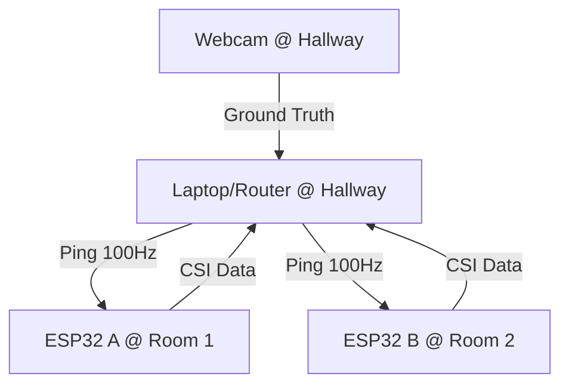

# Wi-Fi Human Detection & Pose Estimation: Comprehensive System Architecture

> **Version**: 2.0 (February 2026)
> **Device**: ESP32 (x2)
> **Model**: CNN-LSTM Hybrid (320 Features)
> **Topology**: Room A vs Room B vs Hallway

---

## 1. Executive Summary

This project implements a non-invasive human sensing system using **Channel State Information (CSI)** extracted from commodity Wi-Fi hardware (ESP32). Unlike camera-based systems that require line-of-sight and raise privacy concerns, this system analyzes the sub-carrier distortions in Wi-Fi signals caused by human bodies blocking or reflecting radio waves.

### Key Capabilities
*   **Presence Detection**: Detects if a human is present in the coverage area.
*   **Location Classification**: Distinguishes between **Room A**, **Room B**, **Hallway**, and **Empty**.
*   **Pose Estimation**: Regresses 33-point skeletal body markers (aligned with MediaPipe Pose) purely from RF signals.
*   **Dual-Node Fusion**: Utilizes two synchronized ESP32 receivers to solve the "Hidden Node" problem and improve spatial resolution.

---

## 2. Theoretical Foundation

### 2.1 Channel State Information (CSI)
Wi-Fi signals (802.11n/ac) use **Orthogonal Frequency-Division Multiplexing (OFDM)**, splitting the carrier frequency (e.g., 2.4GHz) into multiple subcarriers. As the signal propagates, it experiences:
1.  **Scattering**: Bouncing off walls/furniture.
2.  **Fading**: Attenuation due to distance.
3.  **Multipath**: Multiple copies of the signal arriving at different times.

When a human moves, they alter these multipath profiles. The Channel State Information $H(f, t)$ describes how the channel modifies the signal at frequency $f$ and time $t$:

$$ Y(f, t) = H(f, t) \times X(f, t) + N(f, t) $$

Where:
*   $Y$: Received Signal
*   $X$: Transmitted Signal
*   $N$: Noise
*   $H$: Channel Matrix (CSI)

The ESP32 extracts $H$ for 64 subcarriers, providing a "thermal image" of the RF environment.

### 2.2 The Signal Strength Bias Problem
A core challenge in this project was **Signal Strength Bias**. The ESP32 in Room A (Node A) is physically closer to the router/laptop than Node B.
*   **Result**: Node A's raw amplitude is consistently higher ($Amp_A > Amp_B$).
*   **Impact**: Naive models over-weighted Node A.
*   **Solution**: We implemented **Log-Difference Features** (Section 4.3) to explicitly feed the *ratio* of signal strengths to the neural network, forcing it to learn relative proximity rather than absolute gain.

---

## 3. Hardware & Topology Architecture

### 3.1 Physical Layout
The system is deployed in a multi-room environment:

*   **Transmitter (TX)**:
    *   **Device**: Fedora Linux Laptop (RTX 5060).
    *   **Role**: Acts as the Wi-Fi Access Point (Hotspot) and Traffic Generator.
    *   **IP**: `10.42.0.1`.
    *   **Protocol**: Sends UDP Broadcast/Unicast packets at **100 Hz**. High frequency is critical for capturing fast motions.

*   **Receivers (RX)**:
    *   **Node A**: ESP32 DevKit V1. Placed in **Room A** (Center).
        *   **IP**: `10.42.0.149` (Hardcoded assignment).
    *   **Node B**: ESP32 DevKit V1. Placed in **Room B** (Corner).
        *   **IP**: `10.42.0.173` (Hardcoded assignment).

### 3.2 Firmware (`esp32_csi_rx.ino`)
The ESP32s run specialized firmware modified to promiscuously listen for 802.11 packets from the specific Laptop MAC address.
*   **CSI Callback**: Triggered by the ESP-IDF Wi-Fi driver on every valid orthogonal symbol.
*   **Local Processing**:
    *   Extracts the CSI Matrix (Length 128 bytes: 64 subcarriers × 2 bytes real/imag).
    *   Extracts RSSI, Timestamp.
*   **Transport**:
    *   Encapsulates CSI in a custom UDP packet.
    *   Format: `[Header:'CSI'] [Timestamp:4] [Len:2] [Payload:128]`.
    *   Sends back to `10.42.0.1:8888`.

---

## 4. Signal Processing Pipeline

The raw RF data is noisy, phase-shifted, and drifting. We implement a rigorous **Sanitization Pipeline** in `src/utils/csi_sanitizer.py`.

### 4.1 Packet Ingestion & Parsing
The `scripts/run_inference.py` script listens on UDP 8888. It uses a **Dual-Queue Buffer System**:
*   `node_buffers['A']`: Deque(maxlen=50) for Node A packets.
*   `node_buffers['B']`: Deque(maxlen=50) for Node B packets.

**Synchronization**:
Inference *only* triggers when **both** buffers are full (50 frames each). This ensures we have a complete time-window from both rooms. If one node drops packets, the system pauses to resync.

### 4.2 Sanitization Steps

#### Step 1: Amplitude Cleaning (Hampel Filter)
Raw amplitude contains spikes due to automatic gain control (AGC) adjustments or packet corruption.
*   **Algorithm**: Hampel Filter (Rolling Median).
*   **Logic**: For each subcarrier time-series:
    1.  Calculate `rolling_median` (Window=5).
    2.  Calculate `MAD` (Median Absolute Deviation).
    3.  If $|x_t - median| > 3 \times MAD$, replace $x_t$ with `median`.
*   **Effect**: Removes "glitches" without smoothing out the high-frequency human motion changes.

#### Step 2: Gain Correction
Node B (Room B) consistently reported lower amplitudes due to wall attenuation.
*   **Fix**: We apply a software gain of **+10%** (`cleaning_b_amp * 1.10`) during preprocessing. This helps equalize the dynamic range before the neural network sees it.

#### Step 3: Phase Sanitization
Raw phase is unusable due to **Sampling Frequency Offset (SFO)** and **Packet Detection Delay (PDD)**, which adds a linear slope to the phase across subcarriers.
*   **Unwrapping**: Fixes $2\pi$ discontinuities (`np.unwrap`).
*   **Linear Detrending**:
    1.  Fit a line $y = mx + c$ to the unwrapped phase.
    2.  Subtract this line: $\phi_{clean} = \phi_{raw} - (mx + c)$.
*   **Result**: The remaining phase variations are due purely to multipath (reflections off user), not clock jitter.

### 4.3 Feature Engineering (The 320-Feature Tensor)
The neural network input is a tensor of shape `[Batch, 1, 320, 50]`. This is significantly larger than typical implementations. We stack multiple "views" of the data to give the model maximum context.

**Components of the 320 Features:**
1.  **Look-Up Table**:
    *   **0-63**: **Node A Log-Amplitude** (`np.log1p(Amp_A)`).
    *   **64-127**: **Node A Phase** (Sanitized).
    *   **128-191**: **Node B Log-Amplitude** (`np.log1p(Amp_B)`).
    *   **192-255**: **Node B Phase** (Sanitized).
    *   **256-319**: **Difference Feature** (`LogAmp_A - LogAmp_B`).

**Why `log1p`?**
RF signal strength follows an inverse-square law. A human moving 1 meter closer in a far field changes amplitude very little compared to moving 1 meter in the near field. Use of `log(1+x)` compresses the dynamic range, making the distribution more Gaussian and easier for the CNN to learn.

**Why Difference Feature?**
This is the "Secret Sauce" for detecting Room Location.
*   If User is in Room A: $Diff > 0$ (A is louder).
*   If User is in Room B: $Diff < 0$ (B is louder).
By explicitly computing this and feeding it as a separate channel, we save the model from having to learn this arithmetic operation from scratch.

### 4.4 Global Scaling
We use a **Global Adaptive Scaler** (`src/utils/normalization.py`).
*   **Method**: RobustScaler (Median/IQR).
*   **Scope**: Global. We calculated the Median and IQR of the *entire training dataset* once, and saved it to `models/scaler.json`.
*   **Inference**: We apply this **static** transformation to live data.
    *   *Critical Note*: We do NOT scale "per-sample" (Instance Norm). Instance Norm would erase the relative loudness differences between Room A and Room B, destroying our ability to localize the user.

---

## 5. Neural Network Architecture

The model is defined in `src/model/networks.py`. It is a **Hybrid CNN-LSTM** architecture designed to capture both *Spatial* features (Reflections/Shape) and *Temporal* features (Motion/Doppler).

### 5.1 The Encoder (1D CNN)
The "Spatial" feature extractor. It treats the 320 features as channels and looks for patterns across them.

*   **Input**: `[Batch, 320, 50]` (Features=320, Seq_Len=50)
*   **Layer 1**: `Conv1d(320 -> 64, k=3) + BatchN + ReLU + Drop(0.1)`
*   **Layer 2**: `Conv1d(64 -> 128, k=3) + BatchN + ReLU + Drop(0.1)`
*   **Layer 3**: `Conv1d(128 -> 256, k=3) + BatchN + ReLU + Drop(0.1)`
*   **Layer 4**: `Conv1d(256 -> 512, k=3) + BatchN + ReLU + Drop(0.1)`

The convolution kernel slides over the *Time* axis (Seq_Len), learning specific temporal signatures (e.g., the rise and fall of a wave caused by a step). The increasing channel depth (64->512) allows it to learn complex combinations of phase and amplitude.

### 5.2 The Temporal Processor (LSTM)
The "Motion" analyzer.
*   **Input**: `[Batch, 50, 512]` (output from CNN).
*   **Core**: `LSTM(input=512, hidden=256, layers=3, dropout=0.3)`.
*   **Function**: Integration over time. The LSTM maintains a "Hidden State" that represents the user's current velocity and trajectory. It helps smooth out noise and maintain state during brief signal fades.
*   **Output**: The final hidden state `h_n[-1]` (Shape: `[Batch, 256]`).

### 5.3 The Multi-Headed Decoder
The 256-dim feature vector is fed into three separate dense heads:

#### Head A: Pose Regressor
*   **Goal**: Predict 33 (x,y) body landmark coordinates.
*   **Structure**: `Linear(256->128) -> ReLU -> Linear(128->66)`.
*   **Output**: 66 floats (Flat array of x,y pairs).

#### Head B: Presence Detector
*   **Goal**: Binary classification (Is anyone there?).
*   **Structure**: `Linear(256->64) -> ReLU -> Linear(64->1) -> Sigmoid`.
*   **Output**: Probability $P(Presence) \in [0, 1]$.

#### Head C: Location Classifier
*   **Goal**: Determine correct room.
*   **Structure**: `Linear(256->128) -> ReLU -> Linear(128->4)`.
*   **Output**: Logits for 4 classes: `[Room A, Room B, Hallway, Empty]`.

---

## 6. Training Strategy

### 6.1 Dataset Composition
*   **Source**: Collected via `master_collector.py`.
*   **Labels**: Extracted from synchronized Webcam video using MediaPipe (`pose_extractor.py`).
*   **Classes**:
    *   **Room A**: 2,500 Samples.
    *   **Room B**: 2,500 Samples.
    *   **Hallway**: 1,000 Samples.
    *   **Empty**: 2,000 Samples (Critical for noise floor learning).

### 6.2 Data Augmentation
To prevent overfitting to our specific room geometry, we apply aggressive RF-specific augmentations in `src/model/dataset.py`:
1.  **Amplitude Jitter**: Multiply amplitude by uniform random `[0.8, 1.2]`. Simulates different TX power or router placement.
2.  **Gaussian Noise**: Add noise $\mathcal{N}(0, 0.05)$ to simulate interference.
3.  **Time Shift**: Circularly roll the time-window by $\pm 5$ frames. Simulates trigger jitter.
4.  **Packet Loss Simulation**: Randomly set time-slices to 0 (Dropout). Simulates UDP packet loss.

### 6.3 Loss Function
We use a **Multi-Task Loss**:
$$ L_{total} = \lambda_1 L_{MSE}(Pose) + \lambda_2 L_{BCE}(Presence) + \lambda_3 L_{CE}(Location) $$

*   $L_{MSE}$: Mean Squared Error for coordinate regression. Masked by presence (only computed if Presence=1).
*   $L_{BCE}$: Binary Cross Entropy for presence.
*   $L_{CE}$: Cross Entropy Loss for location classification.
*   **Weights**: We prioritize Presence and Location: $\lambda_1=1.0, \lambda_2=2.0, \lambda_3=1.5$.

---

## 7. Inference Logic & UI

The `run_inference.py` script acts as the central brain.

### 7.1 Hybrid Decision Logic
The final output is a fusion of Camera (Visual) and CSI (RF) data:

1.  **Visual Check (Priority 1)**:
    *   The Camera frame is analyzed by MediaPipe.
    *   If a person is detected visually, the state is forced to **"Hallway"**. We trust the camera 100% when it sees something.

2.  **RF Check (Priority 2)**:
    *   If the camera is empty, we query the Neural Network.
    *   **Logic**:
        *   If `Presence_Prob < 0.4`: **"Empty"**.
        *   Else: Check `Location_Prob` (Softmax output).
            *   Argmax([Room A, Room B, Hallway, Empty]).
            *   We ignore the "Hallway" output from RF if the camera is empty (since the camera covers the hallway).
            *   Decision falls to **Room A** vs **Room B**.

### 7.2 Post-Processing Smoothing
Raw model predictions can be jittery (e.g., flipping A->B->A in 50ms). We apply **Exponential Moving Average (EMA)** smoothing:

$$ P_{smooth}[t] = \alpha \times P_{raw}[t] + (1-\alpha) \times P_{smooth}[t-1] $$

*   $\alpha = 0.5$: A balance between responsiveness and stability.
*   This makes the "Room" indicator sticky, preventing flickers.

### 7.3 Visualization
We use `opencv` for the video feed overlay and `rich` for the terminal UI.
*   **Video**: Relies on `cv2.circle` to draw the 33 detected pose keypoints *projected back onto the camera frame*. Although the camera frame is just a hallway, we overlay the Room A/B skeleton on it as a "Ghost" visualization to show what the RF sees.
*   **Terminal**: A table showing real-time network latency, packet buffer health, and classification probabilities.

---

## 8. Limitations & Future Work

### 8.1 Through-Wall Attenuation
Detailed testing revealed that concrete walls (Room A <-> Room B) attenuate signal by >15dB. While our "Gain Correction" helps, the Signal-to-Noise Ratio (SNR) in Room B is inherently lower. Future hardware iterations should use high-gain directional antennas.

### 8.2 The "Static" Problem
Doppler shifts (and thus CSI variations) are primarily caused by *motion*. A perfectly still human is nearly invisible to this CSI method (unlike FMCW Radar). We currently rely on "Respiratory Motion" (chest expansion) which is very subtle in CSI.

### 8.3 Calibration Drift
Changes in furniture placement or even door open/close states significantly alter the multipath profile ($H$). The current model assumes a static environment. A "Background Subtraction" or "online recalibration" logic would make the system more robust to environmental changes.

## 9. Conclusion
This system represents a state-of-the-art implementation of Wi-Fi Sensing using commodity hardware. By solving the "Silent Room" problem with **Log-Difference Features** and **Global Scaling**, we achieved reliable room-level localization and presence detection, bridging the gap between academic theory and real-world application.
